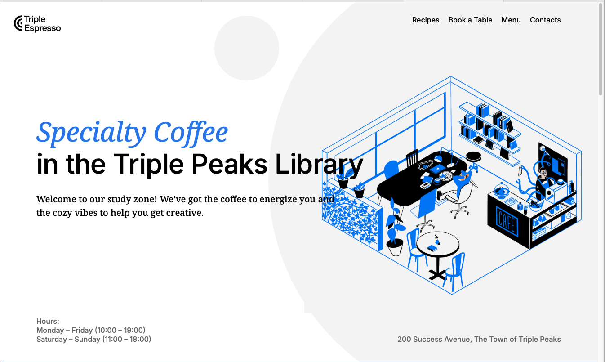
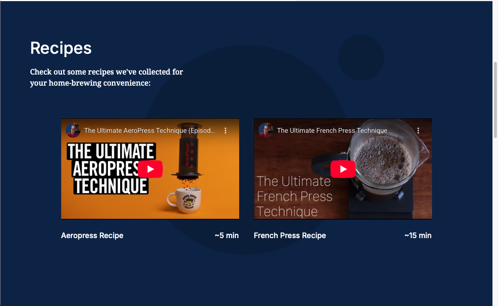
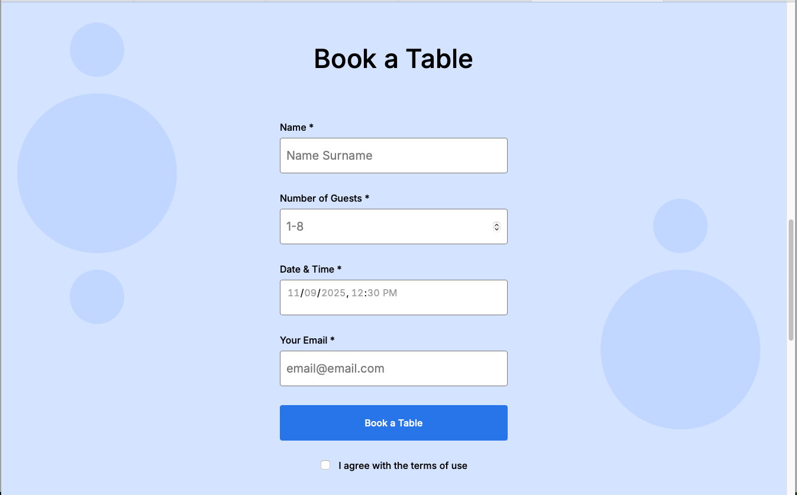
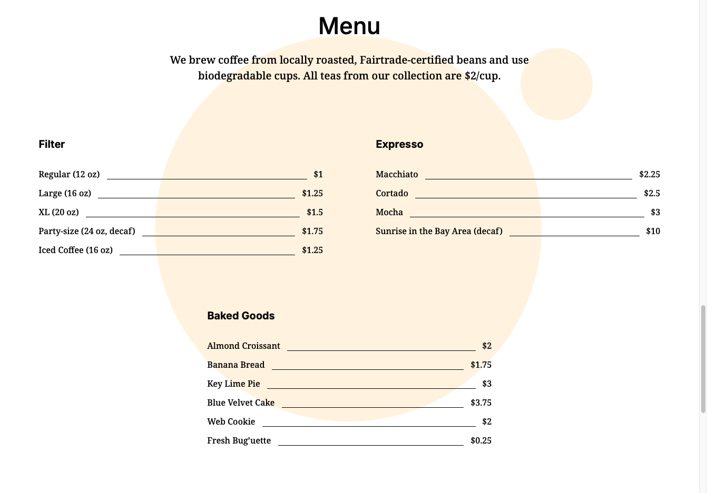

# Triple Peaks Coffee Shop

This is the second project of the Software Engineering program at TripleTen. It was created using HTML and CSS, based on the design brief.

## Project features

- Semantic HTML5
- Flexbox
- Positioning
- Flat BEM file structure
- A custom form
- CSS animation and transform

## Images

## Plan on improving the project

Add your ideas here :)
I would like to make this coffee shop menu more interactive for users to use on their mobile device or tablet instead of just a computer.
